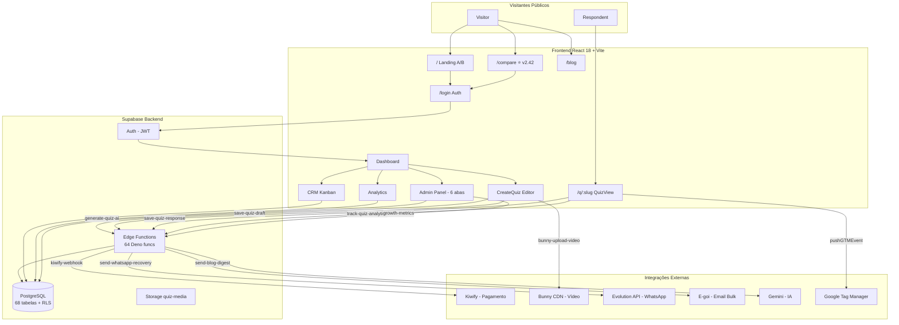

# 🏗️ System Design Document - MasterQuiz

> Plataforma de Funis de Auto-Convencimento — Documentação técnica de arquitetura
> Última atualização: 17 de Abril de 2026 | Versão 2.42.0

---

## 📋 Índice

- [Visão Geral da Arquitetura](#visão-geral-da-arquitetura)
- [Fluxo de Dados](#fluxo-de-dados)
- [Componentes Principais](#componentes-principais)
- [Painel Administrativo](#painel-administrativo)
- [Sistema de Blocos](#sistema-de-blocos)
- [APIs e Edge Functions](#apis-e-edge-functions)
- [Algoritmos Críticos](#algoritmos-críticos)
- [Integrações Externas](#integrações-externas)
- [Segurança e RLS](#segurança-e-rls)
- [Performance](#performance)
- [Sistema de Recuperação WhatsApp](#sistema-de-recuperação-whatsapp)

---

## 🗺️ Diagrama Mermaid — Visão Macro



> **Como ler:** Visitantes públicos chegam pela landing `/`, `/compare` ou `/blog`. Após autenticação, criadores acessam o Dashboard e seus 4 módulos (Editor, CRM, Analytics, Admin). Toda comunicação com banco e integrações externas passa por Edge Functions Deno.

---


```
┌─────────────────────────────────────────────────────────────────────┐
│                         FRONTEND (React 18)                         │
├─────────────────────────────────────────────────────────────────────┤
│  Pages         │  Components    │  Hooks           │  State          │
│  ─────────     │  ──────────    │  ─────           │  ─────          │
│  Index         │  quiz/*        │  useQuizState    │  TanStack Query │
│  CreateQuiz    │  landing/*     │  useAutoSave     │  React Context  │
│  QuizView      │  admin/*       │  usePlanFeatures │  URL State      │
│  Dashboard     │  crm/*         │  useHistory      │                 │
│  CRM/Analytics │  analytics/*   │  useFunnelData   │                 │
└────────────────┴────────────────┴──────────────────┴─────────────────┘
                                    │
                                    │ HTTPS + JWT
                                    ▼
┌─────────────────────────────────────────────────────────────────────┐
│                    SUPABASE (Projeto Externo)                        │
├─────────────────────────────────────────────────────────────────────┤
│  Auth            │  PostgreSQL       │  Edge Functions  │  Storage   │
│  ────            │  ──────────       │  ──────────────  │  ───────   │
│  JWT Sessions    │  RLS em tudo      │  64 funções      │  quiz-media│
│  Email/Password  │  Triggers         │  Deno runtime    │  (público) │
│  Auto-refresh    │  DB Functions     │  _shared/        │            │
└──────────────────┴───────────────────┴──────────────────┴────────────┘
                                    │
                                    ▼
┌─────────────────────────────────────────────────────────────────────┐
│                       INTEGRAÇÕES EXTERNAS                          │
├─────────────────────────────────────────────────────────────────────┤
│  Bunny CDN      │  Kiwify          │  CRMs            │  WhatsApp   │
│  ─────────      │  ──────          │  ────            │  ────────   │
│  Video Storage  │  Payments        │  HubSpot         │  Evolution  │
│  6 EFs dedicadas│  Webhook         │  RD Station      │  API        │
│  Streaming      │  Subscriptions   │  Pipedrive       │  Recovery   │
│                 │                  │  +Email Marketing │             │
└─────────────────┴──────────────────┴──────────────────┴─────────────┘
```

### Stack

| Camada | Tecnologias |
|--------|-------------|
| **Frontend** | React 18, TypeScript, Vite, Tailwind CSS, shadcn/ui, Framer Motion |
| **State** | TanStack Query 5, React Context, useHistory (undo/redo) |
| **Routing** | React Router 6 |
| **i18n** | i18next (PT/EN/ES) |
| **Backend** | Supabase (PostgreSQL, Auth, Edge Functions, Storage) |
| **CDN** | Bunny CDN (vídeos) |
| **Payments** | Kiwify |
| **WhatsApp** | Evolution API |
| **Testes** | Vitest 4, Testing Library |

---

## 🔄 Fluxo de Dados

### 1. Criação de Quiz

```
Template/AI ──▶ Quiz Editor (5 Steps) ──▶ AutoSave (30s) ──▶ Supabase
                     │
                     ├── Step 1: Quantidade de perguntas
                     ├── Step 2: Aparência (título, template, logo)
                     ├── Step 3: Perguntas (blocos, opções, scores)
                     ├── Step 4: Formulário (coleta de dados)
                     └── Step 5: Resultados (always, score, calculator)
```

### 2. Resposta de Quiz (Público)

```
Visitor ──▶ QuizView ──▶ Tracking (GTM/Pixel) ──▶ quiz_analytics
                │                                    quiz_step_analytics
                ▼
           Form (capture) ──▶ quiz_responses ──▶ Webhooks/Integrations
                │
                ▼
            Result ──▶ CTA/Redirect
```

### 3. Pagamento Kiwify

```
User → Kiwify Checkout → Webhook (Edge Function) → user_subscriptions UPDATE → Audit Log
```

### 4. Recuperação WhatsApp

```
Trigger (signup/quiz) → recovery_contacts INSERT → process-recovery-queue → Evolution API → WhatsApp
```

### 5. Tracking GTM (centralizado + lifecycle)

```
UI Action → pushGTMEvent() → dataLayer.push() + gtm_event_logs INSERT
                                    ↓
                          GTM Dashboard (Admin) ← useQuery(gtm_event_logs)

Quiz Lifecycle (useQuizGTMTracking):
  QuizView mount → quiz_view
  First step     → quiz_start
  Result screen  → quiz_complete
  Form submit    → lead_captured
```

---

## 🧩 Componentes Principais

### Hooks (35+)

| Hook | Propósito | Arquivo |
|------|-----------|---------|
| `useQuizState` | Estado completo do editor | `hooks/useQuizState.ts` |
| `useQuizPersistence` | Autosave + CRUD | `hooks/useQuizPersistence.ts` |
| `useHistory` | Undo/Redo | `hooks/useHistory.ts` |
| `useAutoSave` | Debounced save 30s | `hooks/useAutoSave.ts` |
| `useSubscriptionLimits` | Limites por plano | `hooks/useSubscriptionLimits.ts` |
| `usePlanFeatures` | Features booleanas | `hooks/usePlanFeatures.ts` |
| `useFunnelData` | Dados do funil (sem JOIN) | `hooks/useFunnelData.ts` |
| `useUserRole` | Roles do usuário | `hooks/useUserRole.ts` |
| `useUserStage` | Nível PQL | `hooks/useUserStage.ts` |
| `useTestLead` | Gera leads de teste | `hooks/useTestLead.ts` |
| `usePlanUpgradeEvent` | Detecta upgrade free→pago | `hooks/usePlanUpgradeEvent.ts` |
| `useQuizGTMTracking` | GTM lifecycle (view/start/complete/lead) | `hooks/useQuizGTMTracking.ts` |

### Componentes Críticos

| Componente | Propósito |
|------------|-----------|
| `CreateQuiz` | Thin router: delega para `CreateQuizClassic` ou `CreateQuizModern` via `useEditorLayout` |
| `CreateQuizClassic` | Editor Classic 5 steps (lazy-loaded) |
| `CreateQuizModern` | Editor Modern com sidebar de blocos (lazy-loaded) |
| `QuizView` | Renderiza quiz público |
| `UnifiedQuizPreview` | Preview em tempo real |
| `BlockEditor` | Edição dos 34 tipos de blocos |
| `QuestionsList` | Sidebar de perguntas (cards compactos) |
| `CalculatorWizard` | Wizard de calculadoras (3 steps) |
| `ProtectedRoute` | Guard de rotas por role |

---

## 🖥️ Painel Administrativo

### Estrutura de 6 Abas Funcionais (v2.42.0)

```
AdminDashboard
├── 🏠 Início (Dashboard geral)
├── 👥 Usuários (Gestão + PQL + Growth + Suporte)
├── 📝 Conteúdo (Quizzes + Leads + Blog + Templates + GTM Events)
├── 💰 Vendas (Assinaturas + Cupons)
├── ⚙️ Sistema (5 sub-abas)
│   ├── 🩺 Saúde (system-health-check)
│   ├── 📊 Observabilidade (7 painéis)
│   │   ├── SLA Overview
│   │   ├── Custos IA
│   │   ├── Delivery de Email
│   │   ├── Erros 24h
│   │   ├── P95/P99 Performance
│   │   ├── Web Vitals
│   │   └── Health Check Histórico
│   ├── 🗄️ Banco de Dados (68 tabelas com tamanhos reais)
│   ├── ⚙️ Configurações (system_settings, site_settings)
│   └── 🔍 GTM/Diag (verificação em 3 etapas)
└── 🛠️ Dev Tools (Editor Layout + Audit Logs)
```

### Fluxo de Dados — Observabilidade

```
observabilityService.ts ──▶ Supabase Queries (7 domínios)
         │                        │
         ▼                        ▼
  ObservabilityTab.tsx     Dados agregados por período
    (7 Cards/Painéis)      (performance_logs, system_health_metrics,
                            email_recovery_contacts, client_error_logs,
                            ai_quiz_generations, blog_generation_logs)
```

### RPC `get_table_sizes()` (SECURITY DEFINER)

```sql
-- Retorna tamanhos reais das tabelas via pg_total_relation_size
-- Usado no DatabaseMonitorTab para métricas de banco
RETURNS TABLE(table_name text, total_bytes bigint, total_size text, row_estimate bigint)
```

---

## 📦 Sistema de Blocos (34 tipos)

```typescript
type BlockType =
  | 'question' | 'text' | 'separator' | 'image' | 'video' | 'audio'
  | 'gallery' | 'embed' | 'button' | 'price' | 'metrics' | 'loading'
  | 'progress' | 'countdown' | 'testimonial' | 'slider' | 'textInput'
  | 'nps' | 'accordion' | 'comparison' | 'socialProof' | 'animatedCounter'
  | 'callout' | 'iconList' | 'quote' | 'badgeRow' | 'banner'
  | 'answerSummary' | 'progressMessage' | 'avatarGroup'
  | 'conditionalText' | 'comparisonResult' | 'recommendation' | 'calculator';
```

Cada pergunta pode ter múltiplos blocos organizados por `order`. O bloco `question` é obrigatório e define o tipo de resposta (`yes_no`, `single_choice`, `multiple_choice`, `short_text`).

---

## 🔌 APIs e Edge Functions (64 funções)

### Autenticação dos Endpoints

| Tipo | Header | Uso |
|------|--------|-----|
| JWT | `Authorization: Bearer <token>` | Endpoints autenticados |
| Anon | Nenhum ou anon key | Tracking, responses, rate-limiter |
| Token | Query param ou body | kiwify-webhook |

### Padrão de Edge Function

```typescript
// supabase/functions/my-function/index.ts
import { corsHeaders } from '../_shared/cors.ts';

Deno.serve(async (req) => {
  if (req.method === 'OPTIONS') {
    return new Response(null, { headers: corsHeaders });
  }
  try {
    const supabase = createClient(
      Deno.env.get('SUPABASE_URL')!,
      Deno.env.get('SUPABASE_SERVICE_ROLE_KEY')!
    );
    // Lógica...
    return new Response(JSON.stringify({ success: true }), {
      headers: { ...corsHeaders, 'Content-Type': 'application/json' }
    });
  } catch (error) {
    return new Response(JSON.stringify({ error: error.message }), {
      status: 500,
      headers: { ...corsHeaders, 'Content-Type': 'application/json' }
    });
  }
});
```

### Exemplo: generate-quiz-ai

```typescript
// Request
POST /functions/v1/generate-quiz-ai
Authorization: Bearer <jwt>

{
  "mode": "form",
  "productName": "Curso de Marketing",
  "targetAudience": "Empreendedores",
  "numberOfQuestions": 5,
  "desiredAction": "Comprar o curso"
}

// Response
{
  "success": true,
  "quiz": { "title": "...", "questions": [...] },
  "tokens": { "prompt": 500, "completion": 800 }
}
```

---

## 🧮 Algoritmos Críticos

### 1. Motor de Cálculo (`lib/calculatorEngine.ts`)

```
Formula: "(X1 + X2) * 0.15"
Variables: { X1: "question_id_1", X2: "question_id_2" }
Answers: { "question_id_1": "5000", "question_id_2": "3000" }

→ substituteVariables → "(5000 + 3000) * 0.15"
→ evaluateFormula (parser seguro, sem eval) → 1200
→ formatResult('currency', 2) → "R$ 1200.00"
```

### 2. Avaliador de Condições (`lib/conditionEvaluator.ts`)

Suporta operadores: `equals`, `not_equals`, `contains`, `greater_than`, `less_than`.
Lógica: AND/OR entre condições. Detecta ciclos em branching.

### 3. Score Calculation

Soma de scores por opção selecionada → match com `quiz_results` por `min_score`/`max_score`.

### 4. Funnel Analytics (`hooks/useFunnelData.ts`)

```
1. Busca quiz_ids do user via quizzes table
2. Filtra quiz_step_analytics por quiz_ids + date range
3. Agrega por step_number contando sessões únicas (Set)
4. Busca question_text para labels
5. Retorna array ordenado por step_number
```

> **Nota v2.27:** Não usa JOINs PostgREST — queries separadas para robustez.

### 5. GTM Event Logger (`lib/gtmLogger.ts`)

```
pushGTMEvent(event, metadata, { persist })
  1. window.dataLayer.push({ event, ...metadata })
  2. Se persist=true: INSERT gtm_event_logs (fire-and-forget)
  3. Console log com prefixo 🎯

Eventos centralizados: SignupStarted, AccountCreated, PlanUpgraded,
  QuizShared, EditorAbandoned, LeadExported

Eventos legados (NÃO usam o helper — pendente migração):
  - Start.tsx (objective_selected)
  - useQuizTracking.ts (quiz_view, quiz_start, quiz_complete, lead_captured)
  - useQuizPersistence.ts (first_quiz_created, quiz_first_published)
  - useWebVitals.ts (web_vitals)
  - Landing components (cta_click, header_nav_click, pricing_cta_click)
```

---

## 🔗 Integrações Externas

### Kiwify (Pagamento)
- Webhook processa eventos: `order_approved`, `subscription_renewed`, `subscription_canceled`
- Verifica token de autenticação
- Atualiza `user_subscriptions.plan_type`
- Registra em `audit_logs`

### Bunny CDN (Vídeo)
- 6 Edge Functions para upload (simples, multipart, chunked, TUS)
- Secrets: `BUNNY_API_KEY`, `BUNNY_STORAGE_ZONE_NAME`, `BUNNY_STORAGE_ZONE_PASSWORD`, `BUNNY_CDN_HOSTNAME`
- Tabela `bunny_videos` rastreia status

### Evolution API (WhatsApp)
- Conexão via `evolution-connect`
- Webhook bidirecional via `evolution-webhook`
- Templates de mensagem em `recovery_templates`
- Fila de envio em `recovery_contacts`
- Rate limiting: batch_size, delay, horários permitidos

### CRMs e Marketing
- Sync via `sync-integration` (HubSpot, RD Station, Pipedrive, Mailchimp, ActiveCampaign)
- Logs em `integration_logs`

---

## 🔒 Segurança e RLS

### Princípios
1. RLS ativo em **todas** as tabelas
2. Roles verificados via `has_role()` (SECURITY DEFINER) — evita recursão
3. Chaves privadas **nunca** no client — apenas em Edge Functions via secrets
4. Input validado em endpoints públicos
5. Rate limiting obrigatório em endpoints públicos (`rate-limiter`)
6. IPs anonimizados após 6 meses (`anonymize_old_ips()`)

### Padrões RLS

```sql
-- Usuário acessa próprios dados
CREATE POLICY "Users CRUD own data" ON table
  USING (user_id = auth.uid())
  WITH CHECK (user_id = auth.uid());

-- Quiz público acessível
CREATE POLICY "Public viewable" ON child_table
  USING (EXISTS (
    SELECT 1 FROM quizzes
    WHERE quizzes.id = child_table.quiz_id
      AND quizzes.is_public = true
      AND quizzes.status = 'active'
  ));

-- Admin via has_role()
CREATE POLICY "Admins manage" ON admin_table
  USING (has_role(auth.uid(), 'admin') OR has_role(auth.uid(), 'master_admin'));
```

### Triggers de Provisão Automática

```
auth.users INSERT → handle_new_user_profile() → profiles INSERT
                  → handle_new_user_role() → user_roles INSERT (admin)
                  → handle_new_user_subscription() → user_subscriptions INSERT (free)
```

Todos usam `ON CONFLICT DO NOTHING` para idempotência.

---

## ⚡ Performance

### Estratégias Implementadas

| Técnica | Aplicação |
|---------|-----------|
| Lazy loading | 15+ componentes admin, editor bundles |
| Code splitting | 13 chunks Vite separados |
| TanStack Query cache | staleTime 5min para dados admin |
| Debounced autosave | 30s no editor |
| WebP conversion | Imagens no editor |
| ES2020 target | Build menor |
| Memoização | useMemo/useCallback em listas grandes |

### Otimizações de Query

- `useFunnelData`: Queries separadas em vez de JOINs PostgREST (robustez > performance)
- AdminDashboard: `Promise.all()` para queries paralelas
- Paginação: USERS_PER_PAGE = 20, RESPONDENTS_PER_PAGE = 50
- Supabase limit padrão: 1000 rows

---

## 📱 Sistema de Recuperação WhatsApp

### Arquitetura

```
┌──────────────┐     ┌──────────────┐     ┌──────────────┐
│  Triggers    │────▶│  recovery_   │────▶│  process-    │
│  (DB/manual) │     │  contacts    │     │  recovery-   │
└──────────────┘     └──────────────┘     │  queue (EF)  │
                                          └──────┬───────┘
                                                 │
                                                 ▼
                                          ┌──────────────┐
                                          │ Evolution API│
                                          │  (WhatsApp)  │
                                          └──────────────┘
```

### Tabelas
- `recovery_settings`: Configuração global (limites, horários, API)
- `recovery_templates`: Templates de mensagem por categoria (welcome, first_quiz, recovery)
- `recovery_campaigns`: Campanhas automáticas ou manuais
- `recovery_contacts`: Fila de envio com status tracking
- `recovery_blacklist`: Opt-out

### Triggers Automáticos
- `trigger_welcome_on_whatsapp_update()`: Dispara welcome quando WhatsApp é adicionado ao perfil
- `trigger_first_quiz_message()`: Dispara mensagem quando 1º quiz é publicado

---

## 🖼️ Sistema de Rotação de Prompts de Imagem (Blog)

### Arquitetura

```
generate-blog-post / regenerate-blog-asset
        │
        ▼
  blog_image_prompts (SELECT is_active=true, ORDER BY last_used_at ASC)
        │
        ├── Filtra: exclui prompt com last_used_at mais recente (se >1 ativo)
        ├── Seleciona aleatoriamente entre candidatos
        └── UPDATE: last_used_at = now(), usage_count += 1
        │
        ▼
  Gemini API (gera imagem com prompt selecionado)
```

### Tabela `blog_image_prompts`

| Campo | Tipo | Descrição |
|-------|------|-----------|
| `id` | uuid | PK |
| `name` | text | Nome do estilo (ex: "Objetos 3D Vibrantes") |
| `prompt_template` | text | Template com `{{topic}}` como variável |
| `style_description` | text | Descrição curta para UI |
| `is_active` | boolean | Se participa da rotação |
| `last_used_at` | timestamp | Última vez que foi selecionado |
| `usage_count` | integer | Total de vezes usado |

### 5 Estilos Pré-cadastrados

1. **Objetos 3D em Fundo Vibrante** — Modelos 3D em fundos saturados
2. **Pessoa Real em Cenário Pop** — Editorial lifestyle com cores vibrantes
3. **Flat Lay Temático** — Vista de cima com objetos de marketing
4. **Conceitual Hiper-Realista** — Metáforas visuais (foguete, lupa gigante)
5. **Gradiente Abstrato com Elemento Central** — Gradientes neon com ícone 3D

### Fallback

Se nenhum prompt ativo na tabela, usa `blog_settings.image_prompt_template`.

---

## 📧 Sistema de Email Automatizado

### Arquitetura

```
┌──────────────┐     ┌──────────────────┐     ┌──────────────────┐
│  Triggers    │────▶│ email_recovery_  │────▶│ process-email-   │
│  (cron/admin)│     │ contacts         │     │ recovery-queue   │
└──────────────┘     └──────────────────┘     └────────┬─────────┘
                                                       │
       ┌───────────────────────────────────────────────┘
       │
       ▼
┌──────────────────┐     ┌──────────────┐
│ generate-email-  │────▶│ E-goi API    │
│ content (Gemini) │     │ (Bulk/Single)│
└──────────────────┘     └──────┬───────┘
                                │
                                ▼
                         ┌──────────────┐
                         │ egoi-email-  │◀── Webhook (open/click/bounce)
                         │ webhook      │
                         └──────────────┘
```

### Tabelas

| Tabela | Propósito |
|--------|-----------|
| `email_recovery_settings` | Configuração global (limites, horários, sender) |
| `email_recovery_templates` | Templates de email por categoria (13 tipos) |
| `email_recovery_contacts` | Fila de envio com status tracking |
| `email_automation_config` | Configuração de automações (5 tipos) |
| `email_automation_logs` | Logs de execução de automações |
| `email_unsubscribes` | Opt-out de emails |
| `email_tips` | Pool de dicas para weekly_tip |

### Edge Functions de Email (11)

| Função | Tipo | Descrição |
|--------|------|-----------|
| `generate-email-content` | Sob demanda | Gera HTML via Gemini |
| `check-inactive-users-email` | Cron | Detecta inativos |
| `process-email-recovery-queue` | Cron | Processa fila |
| `send-blog-digest` | Cron/Bulk | Digest semanal |
| `send-weekly-tip` | Cron/Bulk | Dica da semana (IA) |
| `send-success-story` | Cron/Bulk | Case de sucesso (IA) |
| `send-platform-news` | Cron/Bulk | Novidades (IA) |
| `send-monthly-summary` | Cron/Individual | Resumo mensal |
| `send-test-email` | Manual | Teste de envio |
| `egoi-email-webhook` | Webhook | Tracking eventos |
| `handle-email-unsubscribe` | Público | Unsubscribe |

### E-goi Bulk API

```
Endpoint: POST https://slingshot.egoiapp.com/api/v2/email/messages/action/send
Payload (array de até 100 itens):
[{
  "domain": "masterquiz.com",
  "senderId": "...",
  "senderName": "MasterQuiz",
  "to": ["user@email.com"],
  "subject": "...",
  "htmlBody": "<html>...(personalizado por user)...</html>",
  "openTracking": true,
  "clickTracking": true
}]
```

### A/B Testing de Assuntos

- Campo `subject_b` nos templates
- Seleção aleatória 50/50 no momento do envio
- Tracking separado por variante (campo `ab_variant` em email_recovery_contacts)
- Dashboard compara open/click rate por variante

---

## 💰 Sistema de Monetização A/B

### Modo A (Freemium) vs Modo B (Apenas Pago)

```
site_mode (system_settings) ──▶ Landing dinâmica
                                     │
                    ┌────────────────┼────────────────┐
                    │ Modo A         │ Modo B          │
                    │ Signup livre   │ Checkout obrig. │
                    │ Dashboard      │ Paywall         │
                    │ free tier      │ payment_confirmed│
                    └────────────────┴────────────────┘
```

### Tabelas
- `subscription_plans`: `price_monthly_mode_b`, `kiwify_checkout_url_mode_b` (fallback para padrão)
- `system_settings`: `site_mode` (A ou B)

### Comparação A×B (ModeComparison.tsx)
- Segmenta métricas por período usando `site_mode_history` ou `landing_ab_sessions`
- Compara cadastros, quizzes criados e conversões pagas por modo

---

## 📚 Documentação Relacionada

| Documento | Descrição |
|-----------|-----------|
| [../README.md](../README.md) | Setup, stack e comandos |
| [PRD.md](./PRD.md) | Requisitos do produto |
| [ROADMAP.md](./ROADMAP.md) | Planejamento estratégico |
| [PENDENCIAS.md](./PENDENCIAS.md) | Changelog |
| [STYLE_GUIDE.md](./STYLE_GUIDE.md) | Padrões de código |
| [CHECKLIST.md](./CHECKLIST.md) | Validação MVP |
| [AUDIT_TEMPLATE.md](./AUDIT_TEMPLATE.md) | Template de auditoria |
| [API_DOCS.md](./API_DOCS.md) | Documentação Edge Functions |
| [COMPONENTS.md](./COMPONENTS.md) | Documentação componentes |
| [BLOCKS.md](./BLOCKS.md) | Catálogo dos 34 tipos de blocos |
| [TESTING.md](./TESTING.md) | Guia de testes |
| [BLOG.md](./BLOG.md) | Guia do blog com IA |
| [EGOI.md](./EGOI.md) | Guia do email marketing |
| [MONETIZATION.md](./MONETIZATION.md) | Monetização A/B e custos |
| [DATABASE_SCHEMA.md](./DATABASE_SCHEMA.md) | Schema completo (68 tabelas) |
| [SECURITY.md](./SECURITY.md) | Práticas de segurança e RLS |
| [CODE_STANDARDS.md](./CODE_STANDARDS.md) | Padrões obrigatórios de código |
| [EDGE_FUNCTIONS.md](./EDGE_FUNCTIONS.md) | Catálogo das 64 Edge Functions |
| [ONBOARDING.md](./ONBOARDING.md) | Guia para novos desenvolvedores |
| [ADR.md](./ADR.md) | Architecture Decision Records |
| [SERVICES.md](./SERVICES.md) | Catálogo de services |
| [MEMOCOPY.md](./MEMOCOPY.md) | Backup de memórias do projeto |
